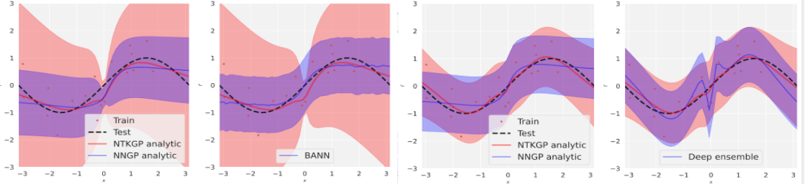

# Bayesian Additive Neural Networks and Deep Ensembles via the Neural Tangent Kernel
Repository, `bayesian-ntk`, to accompany the paper [Bayesian Deep Ensembles via the Neural Tangent Kernel](https://arxiv.org/abs/2007.05864) and our paper [Building Bayesian Neural Networks with blocks: On Structure, Interpretability and Uncertainty](https://arxiv.org/abs/1806.03563). Please note that analytic NTKGP posterior is now implemented in [neural-tangents](https://github.com/google/neural-tangents), more details [here](https://github.com/google/neural-tangents/pull/93).

<p align="center">
  
</p>            

## Requirements

To install requirements:
```setup
pip install -r requirements.txt
```

## Colab Notebook
The functionality of `bayesian-ntk` and the application on our `Bayesian Additive Neural Network` is explained in our notebook `bann-ntk_toy_example.ipynb`, which you can [](https://colab.research.google.com//github/alexdseo/bayesian-ntk/blob/master/bann-ntk_toy_example.ipynb) here.
